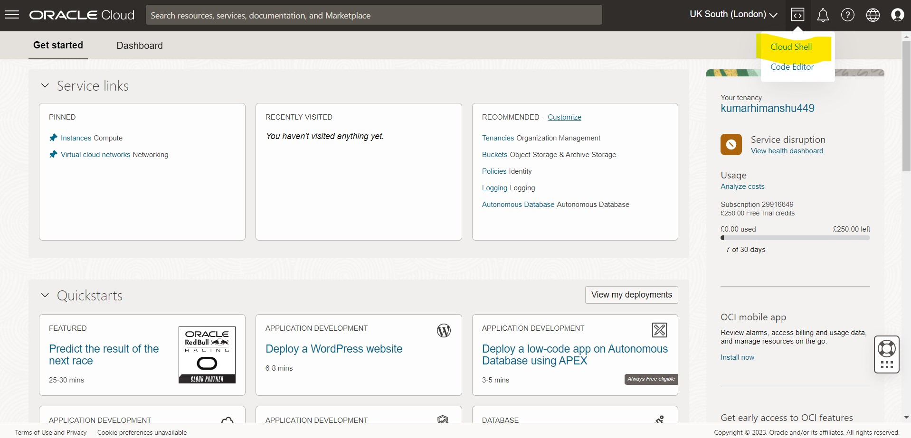
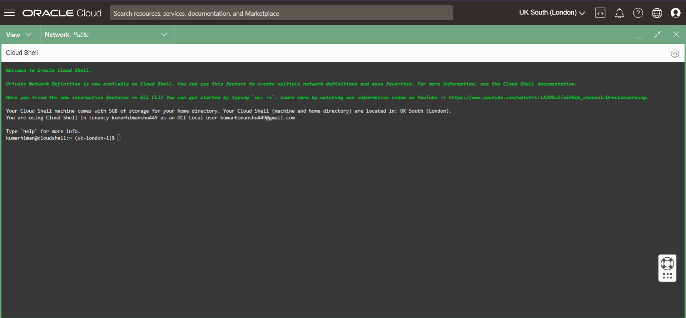
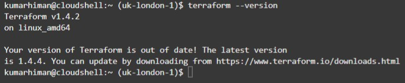

# Lab 00: Install Terraform

### Overview
Install terraform 

### Depends On
None

### Run time
30 minutes

## Option 1

* Open CloudShell1/





* run below command to check the terraform version

    ```shell
    terraform --version
    ```


## Option 2: Use platform install

* Open [page](https://learn.hashicorp.com/tutorials/terraform/install-cli)


* Proceed accordingly

## Option 3

* If you are on AWS, you can use the AWS IDE, Cloud9
* Terraform is already installed there!