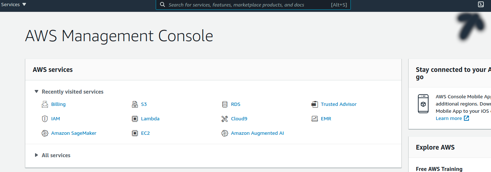
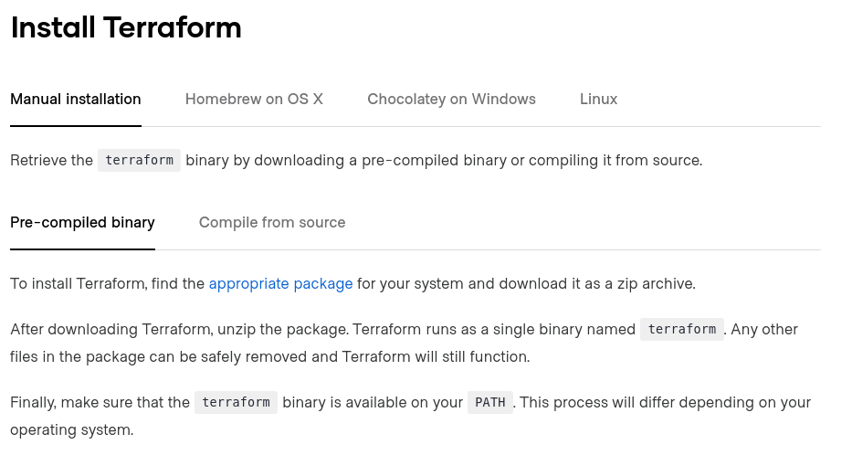

# Lab 00: Install Terraform

### Overview
Install terraform 

### Depends On
None

### Run time
30 minutes

## Option 1

* Open CloudShell



```shell
sudo yum install -y yum-utils
sudo yum-config-manager --add-repo https://rpm.releases.hashicorp.com/AmazonLinux/hashicorp.repo
sudo yum -y install terraform
```
## Option 2: Use platform install

* Open [page](https://learn.hashicorp.com/tutorials/terraform/install-cli)



* Proceed accordingly

## Option 3

* If you are on AWS, you can use the AWS IDE, Cloud9
* Terraform is already installed there!