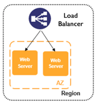

# Lab 02-3-prep: Learn to work with the load balancer

### Overview
* Create two instances
* Connect to them through the load balancer
* This lab is optional or can be done as a demo

### Depends On
* You need an Amazon account

### Qwiklabs alternative 
* Trainer shows a load balancer lab on Google (qwiklabs) or on Amazon (amazon.qwiklabs)

### Run time
* 45 minutes

## Step 1: Login into your Amazon account

## Step 2: Add a security group
* Allow traffic on port 8080 from anywhere    

## Step 3: Launch instances
* Launch two instances (micro instances are enough) in the security group created in the previous step
* Use the same login key for both
* Login into each instance and start the web server response
* Your login command will look like this: `ssh -i .ssh/hi1.pem ubuntu@3.16.76.156`, with your ip and key
* (Most AWS images accept `ubuntu` or `ec2-user` as user names)
* Put the following into `run.sh`

            #!/bin/bash
            echo "Hello, World" > index.html
            nohup busybox httpd -f -p 8080 &
* Make it executable: `chmod +x run.sh`
* `./run.sh`

## Step 4: Verify each instance
* First verify within the instance with `curl`
* Then verify in the browser

## Step 5: Create a load balancer
* Put the two instances created earlier as targets

## Step 6: Verify traffic through the load balancer
* Open the browser at http://<your-elb>:8080

## Step 7: Bonus
* Keep hitting the load balancer, observe which instance you are getting

## Step 8: Bigger bonus

* Try some load tool like JMeter
* Observe performance

## Congratulations, you are now ready to automate this

